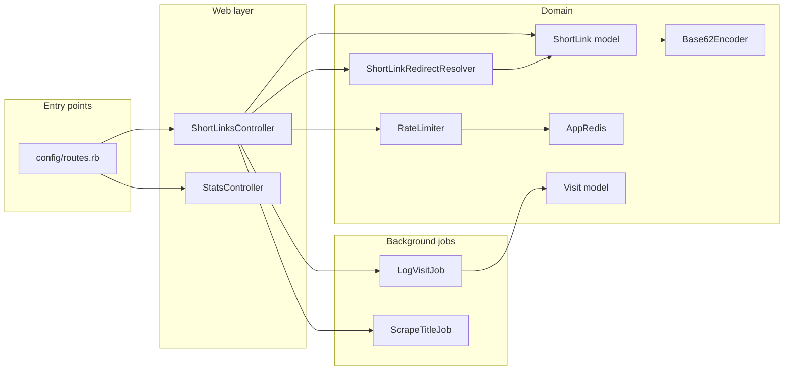

# URL Shortener

## Development

**Prerequisites:** Ruby (see [.ruby-version](.ruby-version)), Docker (for Postgres, ClickHouse, Redis).

**Getting started:**

```bash
bundle install
docker compose up -d
bin/rails db:prepare
```

Optionally set `REDIS_URL=redis://localhost:6379/0` for Redis-backed caching (see [.env.example](.env.example)).

**Run the app:** `bin/rails server` or `bin/dev`

**Run tests:** `bin/rails test`

## Code map (where to look)

Entry point is [config/routes.rb](config/routes.rb): root and `/links` go to `ShortLinksController`, `/r/:short_code` to the redirect action, `/stats` to `StatsController`. Controllers live in `app/controllers/` and stay thin: they parse params, call services or jobs, then render.

- **Redirect flow:** [ShortLinkRedirectResolver](app/services/short_link_redirect_resolver.rb) resolves `short_code` (Rails.cache then DB). Controller enqueues [LogVisitJob](app/jobs/log_visit_job.rb) and redirects. Resolver and rate limiting use [AppRedis](app/services/app_redis.rb) when `REDIS_URL` is set.
- **Create flow:** [ShortLink](app/models/short_link.rb) (Postgres) plus [Base62Encoder](app/services/base62_encoder.rb) for the short code; [RateLimiter](app/services/rate_limiter.rb) caps creates per IP. [ScrapeTitleJob](app/jobs/scrape_title_job.rb) fetches the page title and broadcasts to the index page via Turbo.
- **Stats:** [Visit](app/models/visit.rb) (ClickHouse) and [StatsController](app/controllers/stats_controller.rb). Analytics DB is configured in [config/database.yml](config/database.yml); `ApplicationRecord` → Postgres, `AnalyticsRecord` → ClickHouse.



## Short URL path solution (Wiki)

### How it works

The short path is the **Base62 encoding of the Postgres primary key** (`id`). The implementation lives in [Base62Encoder](app/services/base62_encoder.rb), which uses the charset `0-9`, `a-z`, `A-Z` (62 characters).

When a new link is created, the [ShortLink](app/models/short_link.rb) record is first saved with a temporary `short_code` (e.g. `pending_...`). The `after_create :assign_short_code_from_id` callback then calls `Base62Encoder.encode(id)` and updates the row, so the public path is always derived from the database id.

Path length is capped at **15 characters** to meet the spec (see `MAX_LENGTH = 15` in `Base62Encoder`). Lookup is by `short_code` in the database and in the Redis redirect cache; we never decode the path back to an id.

### Limitations

- **Sequential and guessable:** IDs are sequential, so early links are short and predictable (e.g. id 1 → `"1"`, 62 → `"10"`). Not suitable if you need unguessable links without an extra secret.
- **Max 15 characters:** If `Base62(id)` ever exceeds 15 chars, the encoder keeps only the last 15 (see line 19 in `Base62Encoder`). For ids in the range we use in practice (millions/billions), the encoding is well under 15 chars and unique; truncation only matters at extremely large ids (order of 62^15).
- **No custom slugs:** Users cannot choose a short code (e.g. `/r/my-brand`); every link gets an opaque Base62(id) code.

### Workarounds

- **Unguessability:** Add a random token or signed/expiring URLs if you need non-guessable links later; the current design prioritizes simplicity and compactness.
- **Custom slugs:** Introduce an optional `slug` (or `custom_code`) field with uniqueness and format validation; when present, use it instead of `Base62(id)` for the short path.
- **Very large scale:** If you ever approach ids where Base62(id) exceeds 15 chars, options include raising `MAX_LENGTH` (if the spec allows), or a hybrid scheme (e.g. id + checksum) to avoid collisions when truncating.

## Databases (Postgres + ClickHouse)

The app uses two databases: **primary** (PostgreSQL) for application data and **analytics** (ClickHouse) for analytics. Models inheriting from `ApplicationRecord` use Postgres; models inheriting from `AnalyticsRecord` use ClickHouse.

### Running with Docker

Start Postgres, ClickHouse, and Redis:

```bash
docker compose up -d
```

Postgres listens on port **5432**, ClickHouse HTTP on **8123** and native on **9000**, Redis on **6379**. If host port 9000 is already in use, change the ClickHouse port mapping in `docker-compose.yml` to `"19000:9000"`.

Then prepare the databases:

```bash
bin/rails db:prepare
```

Confirm both are reachable (optional):

```bash
bin/rails runner "ApplicationRecord.connection.execute('SELECT 1'); AnalyticsRecord.connection.execute('SELECT 1'); puts 'OK'"
```

### Environment variables

Optional overrides for local/Docker:

| Variable | Default | Description |
|----------|---------|-------------|
| `PGHOST` | localhost | Postgres host |
| `PGPORT` | 5432 | Postgres port |
| `PGUSER` | url_shortener | Postgres user |
| `PGPASSWORD` | url_shortener | Postgres password |
| `CLICKHOUSE_HOST` | localhost | ClickHouse host |
| `CLICKHOUSE_PORT` | 8123 | ClickHouse HTTP port |
| `CLICKHOUSE_USERNAME` | default | ClickHouse user |
| `CLICKHOUSE_PASSWORD` | clickhouse | ClickHouse password (must match `docker-compose.yml`) |
| `REDIS_URL` | (unset) | Redis URL for rate limiting and redirect cache; when set, the app uses Redis (otherwise rate limit is skipped, redirect cache is DB-only). |
| `SHORT_URL_BASE` | (request host) | Full base URL for short links (e.g. `https://go.example.com`). If unset, links use the current request host (e.g. `127.0.0.1:3000` in dev). |

## Usage report: why "Local" and not my country?

**Why country doesn’t resolve in two cases:**

1. **Local/private IPs (you see "Local")**  
   When you open a short link from the same machine that runs the app, the server sees **127.0.0.1** (or another private IP). We never call a geocoding API for those and label them **"Local"** on purpose — there is no real country for localhost. To see a real country, open the short link from another device/network or use the app in production with public IPs.

2. **Public IPs (you see "unknown")**  
   For public IPs we use **Geocoder** with an IP lookup service. The app is configured in `config/initializers/geocoder.rb` to use **ip-api.com** (free tier, no API key; 45 requests/minute). If you previously saw "unknown" for all visits, it was likely because no IP lookup was configured or the default service was unavailable. With the initializer in place, public IPs should resolve to a country code. For higher limits or HTTPS, you can switch to a paid lookup (e.g. ip-api.com Pro or ipinfo.io) and set the relevant API key in the initializer.

## Caching

The app uses **Redis** (via `REDIS_URL`) for rate limiting and redirect cache when set. Rails cache store (e.g. Solid Cache in production) is separate; when Redis is unset, rate limiting is skipped and redirects resolve from the DB only.

- **Local:** Start Redis with `docker compose up -d`, then set `REDIS_URL=redis://localhost:6379/0` (optional; app falls back to memory store if unset). See `.env.example` for a copy-paste template.
- **Production:** Set `REDIS_URL` when deploying (e.g. via Kamal `config/deploy.yml` env or secrets). The included Kamal config runs a Redis accessory; ensure `REDIS_URL` points at it or at your external Redis.

## Deployment

The app is production-ready with the current setup: health check at `/up`, rate limiting on create, Rails.cache (Redis when `REDIS_URL` is set), and background jobs (Solid Queue). Deploy with [Kamal](https://kamal-deploy.org). Before the first deploy, replace the placeholders in [config/deploy.yml](config/deploy.yml): `servers.web` host(s), `registry.server` (and credentials if needed), and `accessories.redis.host` (e.g. same as web server).
